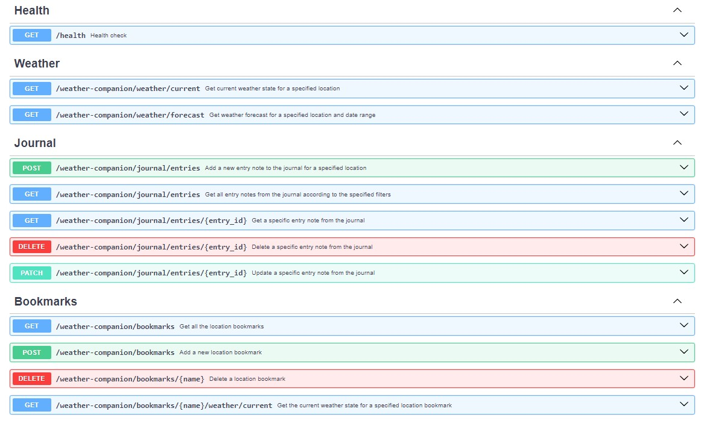

# weather-companion
Api that serves as a weather related info companion for your trips and day to day life

### General description

This documentation contains the following sections:
- **Project structure and packages description**: brief description of dir struct and packages
- **System installation**: description of how to install and run the system 
- **Api Documentation**: brief description of authentication and endpoints overview. Detailed endpoint documentation relies on **fastapi** autogenerated documentation.
- **Additional information**: gives additional information in relation to **dependency management**, **ci pipeline**, **code quality checks**, **dockerization**, **tests**, **makefile usage**... 

### Project structure and packages description

This section gives an overview of the project directory structure, and a brief explanation of the **Packages** found.

Main directories:
- **src**: contains the src code for the whole project
- **src/app**: package that contains the Rest Api implementation that exposes the weather companion system
- **src/weather_companion**: contains the packages that implement the weather companion system. This packages are:
    - **weather_journal**
    - **weather_station**
    - **repository**

- **tests**: mirrors the **src** folder and contains the implemented tests for the system
- **environments**: contains the **Dockerfiles** and **docker-compose** files. See corresponding section for more detail.

A brief explanation of the Packages:
- **weather_station**: Contains a **WeatherStation** interface, implemented by the **OWMWeatherStation** class, that can ask for weather states and forecasts for a given location. **OWMWeatherStation** uses an **OWMWClient**, this is usefull in tests as it enables to implement a client mock and don't have to rely on the **OpenWeatherMap** api at test time. This package also implements the **WeatherState** class that represents the state of the weather at a given moment. Also **Forecast** class, a collection of timestamped **WeatherStates**. **Location** is just a set of coordinates.

- **weather_journal**: main class implemented in this package is a **JournalEntry**, i.e., a **Note** for a given **Location** and for an author identified by **AuthorId**. The package also defines a **JournalEntryFilter** interface. Implementations of this filter interface are: **DateRangeFilter**, **NoteContentFilter**, **LocationProximityFilter**, **AndFilter**. Also **Bookmark** is defined, just a valid string id.

- **repository**: contains the inteface definitions of the repositories needed in the system, these interfaces are **JournalRepository** and **LocationBookmarkRepository**. In memory implementations of these interfaces are **InMemoryLocationBookmarkRepository** and **InMemoryJournalRepository**. 

- **system**: main package that implements a **WeatherCompanion** system. This system dependens on the **WeatherStation**, **JournalRepository** and **Bookmarkrepository**. The in memory implementations of the repositories and Mocks can be used to test the system. **WeatherCompanion** exposes methods to, **(1)** retrieve weather states and forecasts, **(2)** create, delete, filter journal entries, **(3)** create, delete and get weather states for location bookmarks

- **app**: implementation of the Rest Api using **FastApi**. Exposes the **WeatherCompanion** system. See the corresponding section for more details.

### System installation

The application is dockerized. To start the application locally:

- Make sure docker-compose is installed, to check type: 

    `docker-compose --version`

- Clone the repo, check out to **main** branch, and open a terminal in the root folder
- Build the production service using docker compose:

    `docker-compose -f environments/prod/docker-compose.yml build`

- Add your OpenWeatherMap api key value to the **docker-compose** file in the **environments/prod directory** in the **environment** configuration section:

    `- WEATHER_CLIENT_API_KEY=your-api-key`

- Run the service:

    `docker-compose -f environments/prod/docker-compose.yml up`

- Test the API. Open a local browser and go to **http://localhost:8000/health**

Read the API documentation section for more details.

### Api documentation

FastApi auto generates the documentation from the code. 
Once the system is up and running, the documentation can be seen in **http://localhost:8000/docs**

A brief description of the endpoints implemented by the system can be seen in the following picture:

**Note on Authentication**: the weather companion system uses an internal database with valid **apikeys** for user validation. 

For demonstration purpuses, on system start, the database is populated with 3 test users. These are the corresponding test **apikeys** for hese users:
- **8fdce8a4-7d6b-11ee-b962-0242ac120001**
- **8fdce8a4-7d6b-11ee-b962-0242ac120002**
- **8fdce8a4-7d6b-11ee-b962-0242ac120003**

These api keys must be passed as query paramter (**apikey**) on API requests, See API detailed documentation.

### Additional information 

**Dependency management**

The installation and management of package dependencies was implemented using **Poetry**

**Gitflow**

Gitflow was used during implementation 

**CI pipeline**

A CI pipeline was implemented using **github actions**. 
The configuration file can be found in **.github/workflows/ci.yml**. 
The CI workflow runs on every pull request into the **develop** or **main** branch.
Main steps:
- Checkout code
- Build and start services with Docker Compose
- Execute code quality checks: black and isort, same as pre commit hooks
- Execute tests 
- Stop services

**Code quality checks - Commit hooks**

A pre commit configuration file (**.pre-commit-config.yml**) was added so that precommit hooks run on every commit
Hooks:
- black format check
- isort package import order check

These code quality checks are also run during the CI pipe.

**Makefile usage**

A makefile (**Makefile**) was added and frequent used command where added. The makefile targets are:
- test
- format
- code-quality
- api-run

See the makefile **Makefile** for more details

**Dockerization**

The system is dockerized. Test and production envirnomnets are defines in the **environment** directory.
- The test environment is used during the CI pipeline. A volume is atacched to the service to enable code edition in interactive mode.
- The production environment is used on system installation and start. No volume attached in this case.

Port **8000** is exported.

See the corresponding **Dockerfiles** and **compose-files** for more detail.

**Tests**

Tests are implemented using **pytest**. Tests where implemented for the **system**, **weather_journal** and **weather_station** packages. Tests for the rest api are missing.

Tests run automatically in the CI pipeline
- **Note**: more tests should be added, by no means the implelemented tests are complete
- **Note**: coverage computation and report in pipeline was not implemented, should be in future versions

### TODOs

- Implement more tests, particularly for the rest api
- Refactor some tests, use fixtures for repeated code and initialization
- Add logging to the system
- Add retry policy to requests
- Coverage computation and report in CI pipeline, fail if below x%
- Implement a Database as a Docker Service 
- Implement MySql or Postgress versions of databases
- Make the weather station unit system configurable. Metric system fixed for now
- Add **city** parameter in weather state and forecast requesta. This requires an aditional service that translates city name to location.